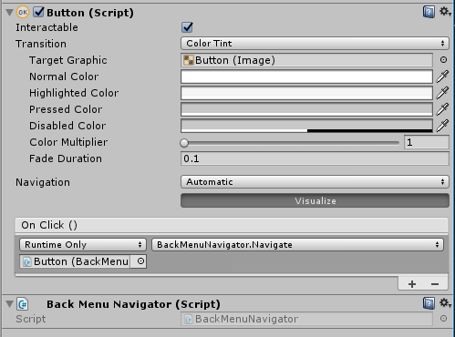

# unity-menustack

A way to track unity menu navigation that doesn't suck too much.

## What

Managing the navigation of menu systems in unity is sucky. __It shouldn't be__.
`unity-menustack` provides simple menu state tracking behaviours.

## How

> See the generated docs ([raw](./docs) or [hosted](https://bengreenier.github.io/Unity-MenuStack)) for more info!

### Prefixing

> By default, prefixing is disabled, since it costs us perf. To use it, set `MenuRoot.DisableRuntimeTagging` to `false`

Prefixing allows the building of menus given just `GameObject` names. At runtime, `Menu` or `OverlayMenu` components are added
to facilitate the actual behaviours we expect.

You can tune which prefixes the system uses with `MenuRoot.MenuPrefix` and `MenuRoot.OverlayPrefix`.

Since this is disabled by default, it's expected that you'll manually add `Menu` or `MenuOverlay` components yourself, to save cycles.

### Basic

+ Include [Assets/Scripts](./Assets/Scripts) in your project
+ Add a `MenuRoot` to some root level menu object
+ Prefix the name of all child menus with `menu`
+ Call `this.GetComponentInParent<MenuRoot>().OpenAsync(Menu)` or ``this.GetComponentInParent<MenuRoot>().CloseAsync()` from any submenu to navigate
+ [Optional] Listen for `MenuRoot.Opened` and `MenuRoot.Closed` events to know when things change

### Overlays

> Overlays are regular menus, except they don't hide the previous menu, they are displayed atop it

To use an overlay, simply prefix the name of a child menu with `overlay`.

### Navigation

> Navigation provides wrappers around the `MenuRoot.OpenAsync(Menu)` and `MenuRoot.CloseAsync()` methods so you don't have to!

See [Assets/Examples/ComplexLayoutRigged.unity](./Assets/Examples/ComplexLayoutRigged.unity) for an example.

That said, the general idea is as follows:  

+ Add some `INavigator` to a component that should trigger navigation
+ Wire the trigger such that it calls `INavigator.Navigate()`
+ Configure additional properties of the specific `INavigator` you chose

Here's a button that's configured as a [BackMenuNavigator](https://bengreenier.github.io/Unity-MenuStack/class_menu_stack_1_1_navigation_1_1_back_menu_navigator.html):

### Animation

> Animation provides support for custom __pretty__ :dancer: transitions between menus!

See [Assets/Examples/AnimatedLayoutRigged.unity](./Assets/Examples/AnimatedLayoutRigged.unity) for an example.

That said, the general idea is as follows:  

+ Add a `MenuAnimator` to some `Menu` that you want to animate
+ This will add an `Animator` that you'll need to setup
+ The Animator should probably have some animations, which will require you to add an `Animation` component
+ The Animator will need an AnimatorController, that you should define
+ The AnimatorController should define two states, one for open, and one for close - by default these are expected to be named `Open` and `Close` (though you can change that)
+ The AnimatorController should define two triggers, to enter each of these states - these must be named the same as the states
+ The AnimatorController should define transitions between the two states, and each trigger should be a condition
+ [Optional] you probably don't want your animation clips to loop, so select them, and turn off looping in the inspector

This will make your menus transition from `Close` to `Open` when they open, and `Open` to `Close` when they close.

## Examples

There's a few examples under [Assets/Examples](./Assets/Examples). These should cover the major use cases
and are fairly self explanatory. I'll do some deep dive explanations in the near future.

## License

MIT